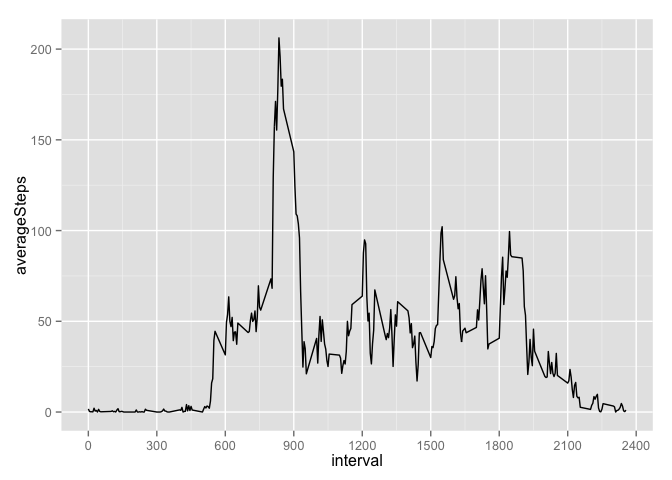

# Reproducible Research: Peer Assessment 1

***  
### Loading and preprocessing the data
  
Initial steps to load and preprocess the data include:  
1. Load the activity.csv data  

```r
setwd("~/Documents/Lisa Documents/Coursera_Data_Science/Rep_Research/assignment1/RepData_PeerAssessment1")
stepData <- read.csv("activity.csv")
```
         
2. Convert factor "dates" to real dates  

```r
library(lubridate)
stepData$date <- ymd(stepData$date)
str(stepData)
```

```
## 'data.frame':	17568 obs. of  3 variables:
##  $ steps   : int  NA NA NA NA NA NA NA NA NA NA ...
##  $ date    : POSIXct, format: "2012-10-01" "2012-10-01" ...
##  $ interval: int  0 5 10 15 20 25 30 35 40 45 ...
```
  
***  
***  
### What is the mean total number of steps taken per day?
The total number of steps per day can be calculated as follows:  
  

```r
library(reshape2)
stepData2 <- melt(stepData, id=c("date","interval"))
stepsPerDay <- dcast(stepData2, date ~ ., sum)
colnames(stepsPerDay)[2] <- "totalSteps"
```
  
A histogram will illustrate the range of variation in the daily number of steps:  
  

```r
library(ggplot2)
plot1 <- ggplot(data=stepsPerDay, aes(totalSteps)) + geom_histogram(binwidth=1000)
plot1
```

 

```r
meanSteps1 <- round(mean(stepsPerDay$totalSteps, na.rm=TRUE))
medianSteps1 <- median(stepsPerDay$totalSteps, na.rm=TRUE)
```
  
The mean daily number of steps is 10766 and the median daily number of steps is 10765. 

***  
***
### What is the average daily activity pattern?
The average number of steps per interval (calculated over all days) can be calculated as follows: 
  

```r
averagePerInterval <- dcast(stepData2, interval~.,mean, na.rm=TRUE)
colnames(averagePerInterval)[2] <- "averageSteps"
ggplot(averagePerInterval, aes(x=interval, y=averageSteps)) + geom_line() +
  scale_x_continuous(breaks=seq(0,2400,by=300))
```

 

```r
maxInterval <- averagePerInterval$interval[averagePerInterval$averageSteps == max(averagePerInterval$averageSteps)]
```
The 5 minute interval which contains the maximum number of steps, on average across all days in the data set is interval
835.  It seems likely that the peak in steps around interval 835 represents a regular and habitual pattern of activity, such as a walk to work. 
  
***
***  
### Imputing missing values
The number of missing values can be calculated as follows:

```r
numMissing <- sum(is.na(stepData2$value))
allMissing <- stepData2[is.na(stepData2$value),]
got <- stepData2[!is.na(stepData2$value),]
summaryMissing <- dcast(allMissing, date ~ .,length)
summaryGot <- dcast(got, date ~ .,length)
```
We can see that 2304 of the lines are missing. The data for 8 entire dates are missing (rather than certain intervals within dates).  
  
Next we impute the missing values based on the mean value per interval.  

```r
# replace missing data
stepDataImpute <- stepData
for (i in 1: nrow(averagePerInterval)) {
  stepDataImpute$steps[is.na(stepDataImpute$steps) & (stepDataImpute$interval == averagePerInterval$interval[i])] <- 
    averagePerInterval$averageSteps[i]
}

# reshape data
stepDataImpute2 <- melt(stepDataImpute, id=c("date","interval"))
stepsPerDayImpute <- dcast(stepDataImpute2, date ~ ., sum)
colnames(stepsPerDayImpute)[2] <- "totalSteps"
```
  
  
We can compare the histograms for the original dataset with missing values, and the new dataset with imputed values:

```r
# create histogram
plot2 <- ggplot(data=stepsPerDayImpute, aes(totalSteps)) + geom_histogram(binwidth=1000)

# compare plots
library(grid)
library(gridExtra)
grid.arrange(plot1, plot2, ncol=2,nrow=1)
```

 

```r
# calculate statistics
meanSteps2 <- round(mean(stepsPerDayImpute$totalSteps, na.rm=TRUE))
medianSteps2 <- median(stepsPerDayImpute$totalSteps, na.rm=TRUE) 
```
  
After replacing missing values with the mean value for interval, the new imputed mean daily number of steps is 10766 and the new imputed median daily number of steps is 10766.  Although the mean and median are largely unchanged, the histogram shows that the distribution of total steps per day is different (taller and narrower). 

***
***  
### Are there differences in activity patterns between weekdays and weekends?
First, identify the weekends and weekdays using the wday() function from lubridate.  
  

```r
weekday <- seq(2,6,by=1)
stepDataImpute$dayNum <- wday(stepDataImpute$date)
stepDataImpute$dateType <- "weekend"
stepDataImpute$dateType[stepDataImpute$dayNum %in% weekday] <- "weekday"
stepDataImpute$dateType <- as.factor(stepDataImpute$dateType)
stepDataImpute <- stepDataImpute[,-4]
str(stepDataImpute)
```

```
## 'data.frame':	17568 obs. of  4 variables:
##  $ steps   : num  1.717 0.3396 0.1321 0.1509 0.0755 ...
##  $ date    : POSIXct, format: "2012-10-01" "2012-10-01" ...
##  $ interval: int  0 5 10 15 20 25 30 35 40 45 ...
##  $ dateType: Factor w/ 2 levels "weekday","weekend": 1 1 1 1 1 1 1 1 1 1 ...
```
  
Create a panel plot to show the difference in the average steps per interval between weekend and weekday dates.
  

```r
plot3melt <- melt(stepDataImpute, id=c("date","interval","dateType"))
plot3Data <- dcast(plot3melt, interval + dateType ~ variable, mean)
plot3 <- ggplot(plot3Data, aes(x=interval,y=steps, group=dateType)) + geom_line() +
  scale_x_continuous(breaks=seq(0,2400,by=300)) + facet_grid(dateType~.)
plot3
```

 
  
When we compare the weekdays to weekend days we see that the subject:  

* sleeps in on the weekend days  
* has an alarm set for 5:00 am on weekdays  
* is more active on many weekend day intervals than weekday intervals (especially in the middle of the day)  
* is most active weekday mornings, as noted previously  
